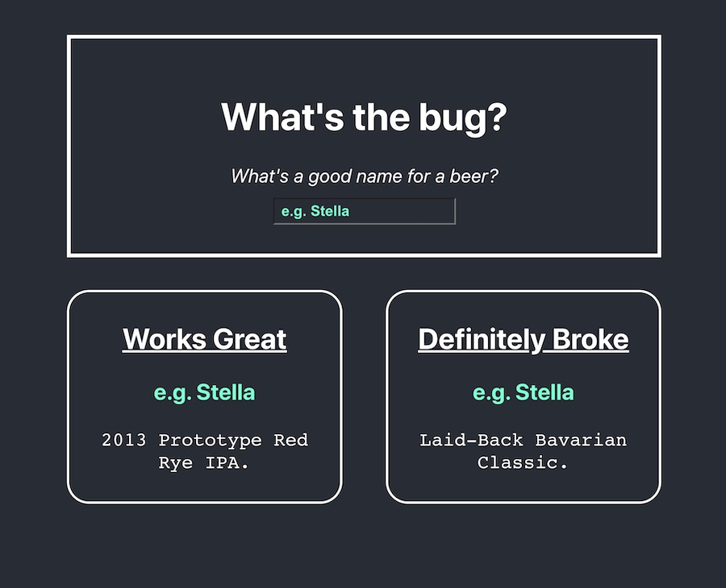

# useEffect bug demo

Please see the CodeSandbox: https://codesandbox.io/s/github/tyreer/hooks-learning

This is a reproduction of a bug described in Kent C. Dodd's Egghead course [Simplify React Apps with React Hooks](https://egghead.io/courses/simplify-react-apps-with-react-hooks)

- Answer/explanation of the bug [here](https://github.com/tyreer/learning-notes/blob/master/Egghead_simplify-react-apps-with-react-hooks.md#demo)
- Notes on the Kent C. Dodds lesson, _Handle Deep Object Comparison in React's useEffect hook with the useRef Hook_, [here](https://github.com/tyreer/learning-notes/blob/master/Egghead_simplify-react-apps-with-react-hooks.md#handle-deep-object-comparison-in-reacts-useeffect-hook-with-the-useref-hook)
- Beer descriptions from the BrewDog Punk API: https://punkapi.com/documentation/v2
